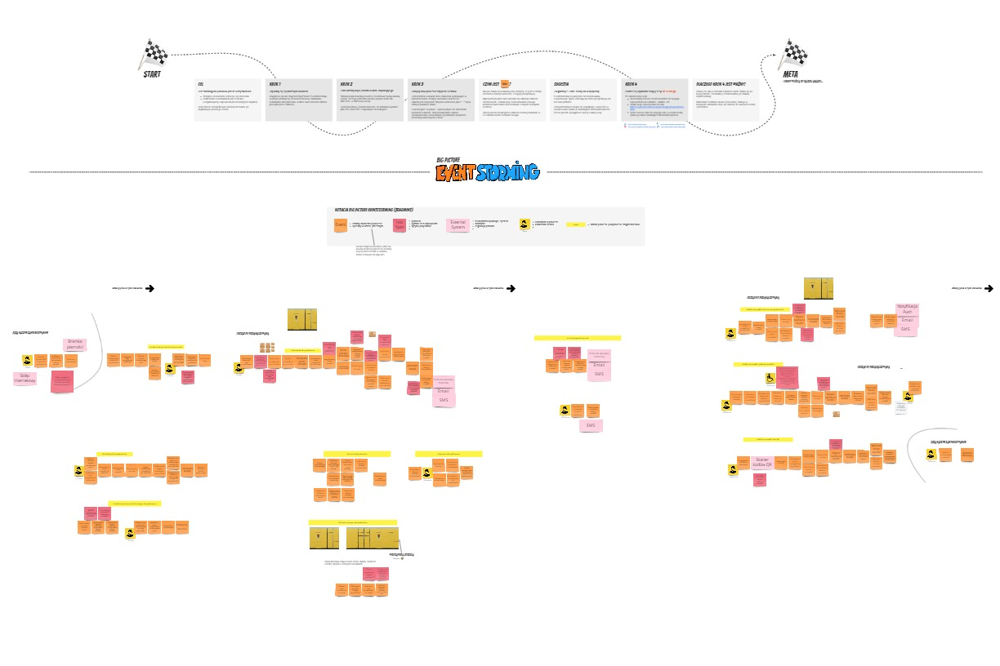

# Domain Explorers
Pierwsze podejście

Teraz już wiem, że inaczej zrobiłbym pewne rzeczy:
1. Dodawanie nowego skrzynkomatu osobno powinien być dodawany skrzynkomat i osobno dodawanie skrzynek, tym sposobem rozbudowa o dodatkowe skrzynki nie wymagałaby zmiany obiektu skrzynkomatu.
2. Umieszczenie paczek w multi-skrzynce powinien kurierowi podpowiadać system-> "Dla odbiorcy tej paczki masz jeszcze inne paczki o numerach ........". Kurierowi raczej :) trudno będzie zweryfikować która paczka dla kogo i pamiętać, że już dla tego klienta ma paczkę.

Link do mojego board'u [tutaj](https://miro.com/app/board/o9J_lVufS6A=/). 